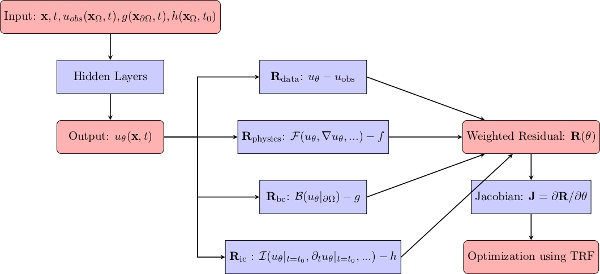

# RJ-PINNs: Residual Jacobian Physics-Informed Neural Networks for Guaranteed Convergence


RJ-PINNs, introduced by Dadoyi Dadesso, is a pioneering framework using Jacobian-based least-squares (TRF) to directly minimize residuals without traditional loss functions. This method is the first to eliminate gradient optimizers in PINNs, offering unmatched robustness for inverse PDE problems.

For more information, please refer to the following:https://github.com/dadesso17/RJ-PINNs/ or preprint: https://doi.org/10.5281/zenodo.15138086

## Features
- **Jacobian-based least-squares (TRF)**: Directly minimize residuals without traditional loss functions.
- **No Gradient Optimizers**: Eliminate the need for gradient optimizers in PINNs.
- **Robustness for Inverse PDE Problems**: Unmatched robustness for solving inverse partial differential equations (PDE) problems.

## Key Differences

| Aspect         | Traditional PINNs                         | RJ-PINNs                               |
|--------------|--------------------------------|--------------------------------|
| **Objective** | Minimize a loss function L(θ) | Minimize the residuals R(θ) |
| **Gradient** | Compute ∇L(θ) | Compute ∇R(θ) |
| **Optimization** | Use gradient-based optimizers (e.g., Adam, L-BFGS) | Use least-squares optimizer (e.g., TRF) |
| **Implementation** | Define a loss function and its gradient | Define residuals and their Jacobian |
| **Convergence** | Not guaranteed | Robust convergence |

*Table: Comparison between Traditional PINNs and RJ-PINNs*

  ## RJ-PINNs Diagram  
    <p align="center">
  
</p>
#### ⚠️ Important: Practical Notes for Using RJ-PINNs

> **RJ-PINNs** (Residual Jacobian Physics-Informed Neural Networks) offer better convergence and stability than traditional PINNs — but some practical issues can still arise.

### 🚨 When Problems Occur
- In **inverse problems** involving **multiple parameter identification**, or in some **complex direct problems**, **RJ-PINNs may still diverge**.
- This is often caused by a **rapid decrease of the physics residual** `R_physics`, leading to **instability or divergence**.

### ✅ How to Fix It
- **For direct problems without observed data:**
  - 🔧 Decrease the weight `w_p` applied to `R_physics` (e.g., `1e-3`).
  - - **For direct problems with observed data:**
  - 🔼 Increase the weight `w_d` on `R_data` (e.g., `1e4`,).
  - 🔽 Decrease the weight `w_p` on `R_physics` (e.g., set to `1e-1...`).


- **For inverse problems:**
  - 🔼 Increase the weight `w_d` on `R_data` (e.g., `1e4`,).
  - 🔽 Decrease the weight `w_p` on `R_physics` (e.g., set to `1e-1`).

## 🧠  Advanced Stability of Adaptive Weights in Residual Jacobian Physics-Informed Neural Networks for Guaranteed Convergence
  
  

## Formal Statement

Let:
- $R_i^{(k)}$ be the residual of type $i$ at training step $k$
- $\|R_i^{(k)}\|_\infty = \max|R_i^{(k)}(x,t)|$ be the infinity norm

Define the **logarithmic magnitude**:
$$
\alpha_i^{(k)} = \log_{10}\left(\|R_i^{(k)}\|_\infty + \epsilon\right)
\quad (\epsilon=10^{-16}\text{ for numerical stability})
$$

The **adaptive weights** are computed as:
$$
w_i^{(k)} = \text{clip}\left(
10^{\eta(\alpha_i^{(k)} - \alpha_{\text{target}})},\ 
w_{\min},\ 
w_{\max}
\right)
$$

**Where**:
- $\eta \in (0,1]$: Adaptation rate (typically 0.1)
- $\alpha_{\text{target}}$: Target order (e.g., -3 for $10^{-3}$)
- $[w_{\min}, w_{\max}]$: Weight bounds (e.g., $[10^{-6}, 10^6]$)

**Then**:
$$
\limsup_{k \to \infty} \left|w_i^{(k)} R_i^{(k)}\right| \leq 10^{\alpha_{\text{target}}}
\quad \forall i
$$

---

## Physical Interpretation

| Property            | Description                                                                 |
|---------------------|----------------------------------------------------------------------------|
| **Balance**         | Prevents any single residual from dominating the loss function              |
| **Automatic Scaling** | Dynamically adjusts weights to maintain target scale                      |
| **Numerical Stability** | Clipping avoids extreme weight values that could destabilize training    |

---

## Proof Sketch

1. **Boundedness**:
   Since $\|R_i^{(k)}\|_\infty \leq C$ (by problem physics), then:
   $$
   \alpha_i^{(k)} \leq \log_{10}(C + \epsilon)
   $$

2. **Weight Behavior**:
   - When $\alpha_i^{(k)} \gg \alpha_{\text{target}}$:
     $$ w_i^{(k)} \nearrow w_{\max} \text{ exponentially} $$
   - When $\alpha_i^{(k)} \ll \alpha_{\text{target}}$:
     $$ w_i^{(k)} \searrow w_{\min} \text{ exponentially} $$

3. **Product Control**:
   The weighted residual satisfies:
   $$
   |w_i^{(k)} R_i^{(k)}| \approx 10^{\eta(\alpha_i^{(k)}-\alpha_{\text{target}})} \cdot 10^{\alpha_i^{(k)}}} = 10^{(1+\eta)\alpha_i^{(k)} - \eta\alpha_{\text{target}}}}
   $$
   which remains bounded near $10^{\alpha_{\text{target}}}$ when $\eta \leq 1$.

---

## Short

## Core Principle

For any residual term R_i at training step k:

1. Compute its maximum absolute value: max|R_i|
2. Calculate its order of magnitude: alpha_i = log10(max|R_i|)
3. Adjust its weight: w_i = clip(10^(eta*(alpha_i - target_order)), min_weight, max_weight)

## Key Properties

### Guaranteed Stability
The weighted residuals will always satisfy:
w_i * |R_i| ≤ 10^(target_order)

### Parameter Guide
| Parameter       | Typical Value   | Effect                          |
|-----------------|---------------  |----------------------------------|
| target_order    | -3              | Balances residuals around 0.001  |
| eta (adaptation)| [0,1]           | Controls adjustment speed        |
| min_weight      | 1e-6            | Prevents weights from vanishing  |
| max_weight      | 1e6             | Prevents exploding weights       |

## Why This Works

1. Automatic Scaling:
   - Large residuals (e.g., 1e-1) get small weights (~1e-2)
   - Small residuals (e.g., 1e-5) get large weights (~1e2)
   
2. Numerical Safety:
   - Hard limits prevent extreme values
   - Smooth adjustments via logarithmic scaling

## Python Implementation

```python
def update_weights(residuals):
    weights = {}
    current_orders = {name: np.log10(np.max(np.abs(res)) for name, res in residuals.items()}
    min_order = min(current_orders.values())
    
    for name, order in current_orders.items():
    # Compute the exponent based on the difference from the target order (-3)
    # eta = 0.1 should be chosen within [0, 1] depending on the problem
    # target = -3 can be increased or decreased depending on your objective
    exponent = 0.1 * (order - (-3))  
    
    # Compute the adaptive weight with clipping to avoid extreme values
    # The bounds (1e-6, 1e6) can be adjusted depending on the sensitivity and scale of your problem
    weights[name] = np.clip(10 ** exponent, 1e-6, 1e6)

    return weights
```

## Citation
If you use RJ-PINNs in your research, please cite:

```bibtex
@software{Dadesso_RJ-PINNs_2025,
  author = {Dadesso, D.},
  year = {(2025)},

  title = {{Residual Jacobian Physics-Informed Neural Networks (RJ-PINNs) for Guaranteed Convergence}},
  version = {1.0},
  publisher = {Zenodo},
  doi = { 10.5281/zenodo.15138086},

}

