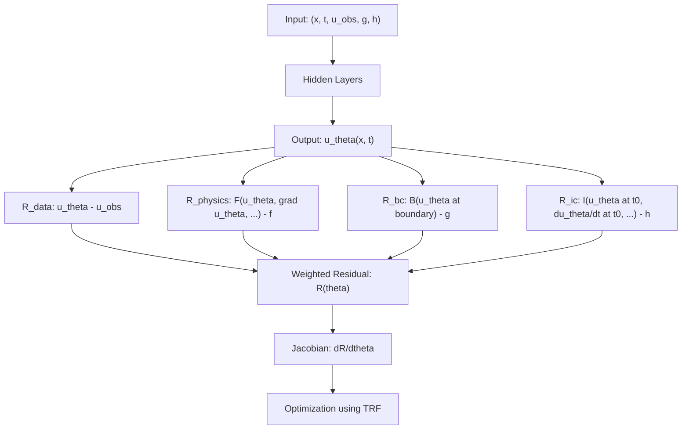

## RJ-PINNs
I introduce RJ-PINNs: A breakthrough PINNs framework using Jacobian-based least-squares (TRF) to directly minimize residuals without traditional loss functions. First method to eliminate gradient optimizers in PINNs, offering unmatched robustness for inverse,direct PDE problems 


For more information, please refer to the following:(https://github.com/dadesso17/RJ-PINNs/)

## Key Differences

| Aspect         | Traditional PINNs                         | RJ-PINNs                               |
|--------------|--------------------------------|--------------------------------|
| **Objective** | Minimize a loss function L(θ) | Minimize the residuals R(θ) |
| **Gradient** | Compute ∇L(θ) | Compute ∇R(θ) |
| **Optimization** | Use gradient-based optimizers (e.g., Adam, L-BFGS) | Use least-squares optimizer (e.g., TRF) |
| **Implementation** | Define a loss function and its gradient | Define residuals and their Jacobian |
| **Convergence** | Not guaranteed | Robust convergence |

*Table: Comparison between Traditional PINNs and RJ-PINNs*



flowchart TD
    A["Input: Model inputs and observations"] --> B["Hidden Layers"]
    B --> C["Model Prediction"]
    
    C --> D1["Data Difference"]
    C --> D2["Physics Constraint"]
    C --> D3["Boundary Condition"]
    C --> D4["Initial Condition"]
    
    D1 --> E["Combined Residual"]
    D2 --> E
    D3 --> E
    D4 --> E
    
    E --> F["Compute Sensitivity"]
    F --> G["Optimization Process"]

## Citation
If you use RJ-PINNs in your research, please cite:

```bibtex
@software{Dadesso_RJ-PINNs_2025,
  author = {Dadesso, Dadoyi},
  title = {{Residual Jacobian Physics-Informed Neural Networks (RJ-PINNs)}},
  year = {2025},
  version = {1.0},
  publisher = {Zenodo},
  doi = {10.5281/zenodo.15138086}
}
